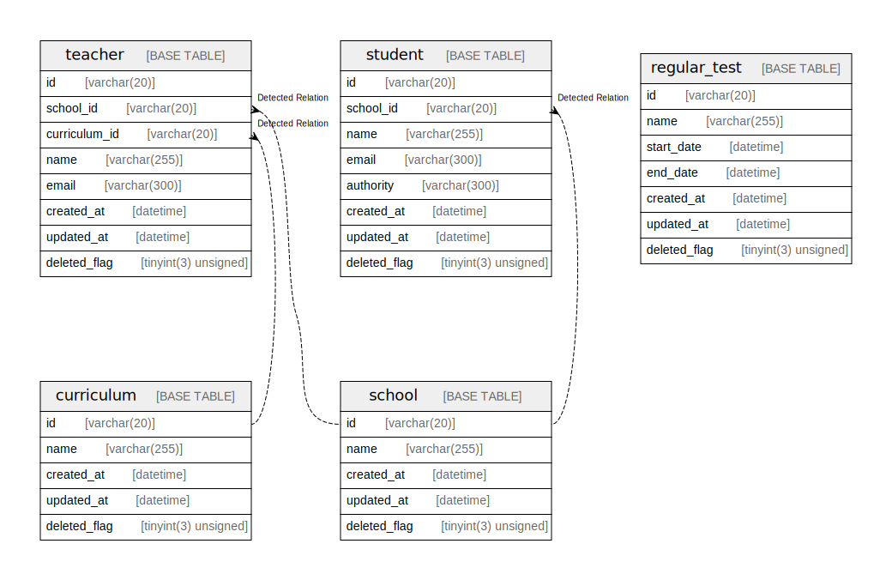

# test_db

## Tables

| Name | Columns | Comment | Type |
| ---- | ------- | ------- | ---- |
| [school](school.md) | 5 |  | BASE TABLE |
| [user](user.md) | 8 |  | BASE TABLE |

## Relations

---

> Generated by [tbls](https://github.com/k1LoW/tbls)
