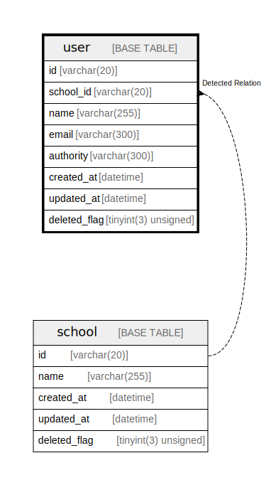

# user

## Description

<details>
<summary><strong>Table Definition</strong></summary>

```sql
CREATE TABLE `user` (
  `id` varchar(20) COLLATE utf8mb4_bin NOT NULL,
  `school_id` varchar(20) COLLATE utf8mb4_bin NOT NULL,
  `name` varchar(255) COLLATE utf8mb4_bin NOT NULL,
  `email` varchar(300) COLLATE utf8mb4_bin NOT NULL,
  `authority` varchar(300) COLLATE utf8mb4_bin NOT NULL,
  `created_at` datetime NOT NULL,
  `updated_at` datetime NOT NULL,
  `deleted_flag` tinyint(3) unsigned NOT NULL,
  PRIMARY KEY (`id`)
) ENGINE=InnoDB DEFAULT CHARSET=utf8mb4 COLLATE=utf8mb4_bin
```

</details>

## Columns

| Name | Type | Default | Nullable | Children | Parents | Comment |
| ---- | ---- | ------- | -------- | -------- | ------- | ------- |
| id | varchar(20) |  | false |  |  |  |
| school_id | varchar(20) |  | false |  | [school](school.md) |  |
| name | varchar(255) |  | false |  |  |  |
| email | varchar(300) |  | false |  |  |  |
| authority | varchar(300) |  | false |  |  |  |
| created_at | datetime |  | false |  |  |  |
| updated_at | datetime |  | false |  |  |  |
| deleted_flag | tinyint(3) unsigned |  | false |  |  |  |

## Constraints

| Name | Type | Definition |
| ---- | ---- | ---------- |
| PRIMARY | PRIMARY KEY | PRIMARY KEY (id) |

## Indexes

| Name | Definition |
| ---- | ---------- |
| PRIMARY | PRIMARY KEY (id) USING BTREE |

## Relations



---

> Generated by [tbls](https://github.com/k1LoW/tbls)
